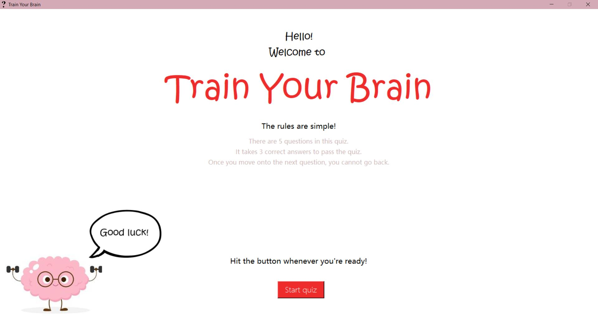
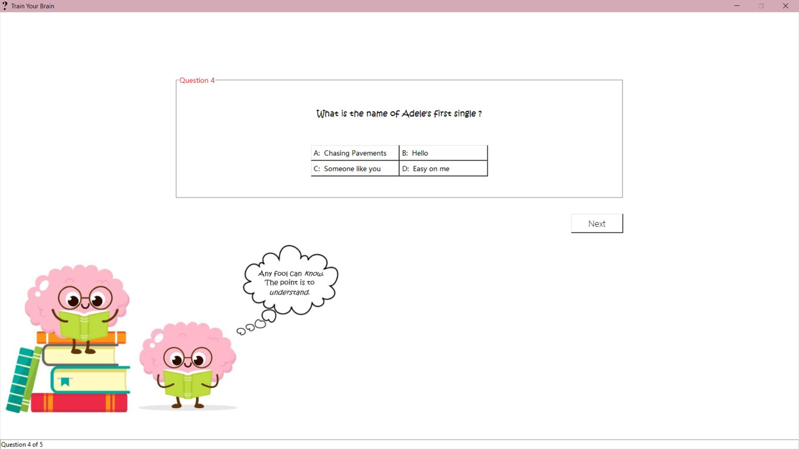
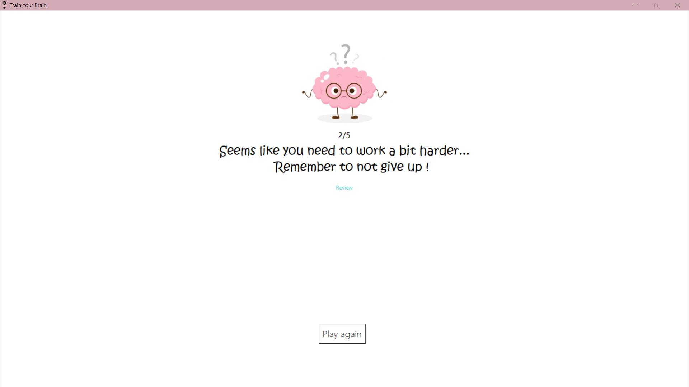
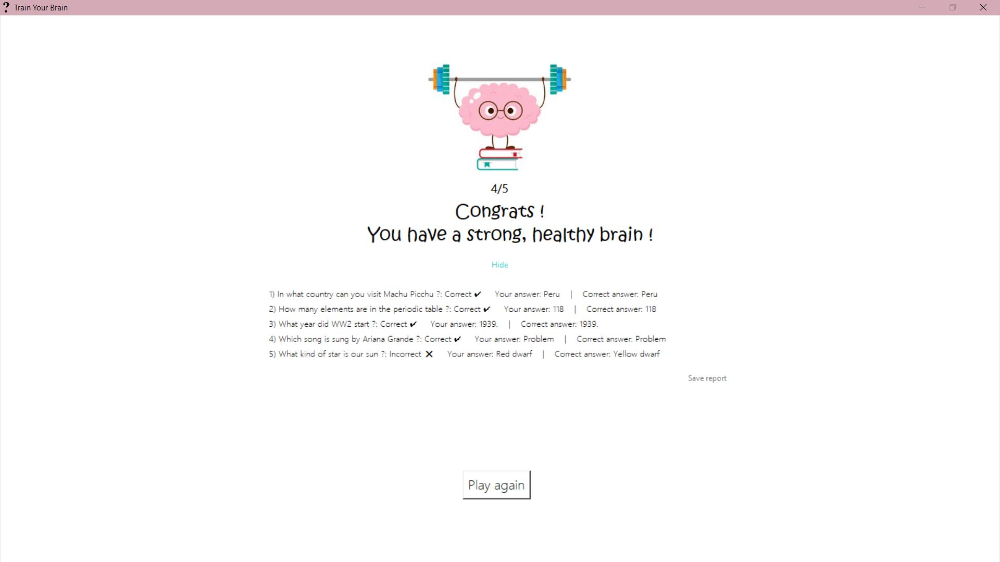
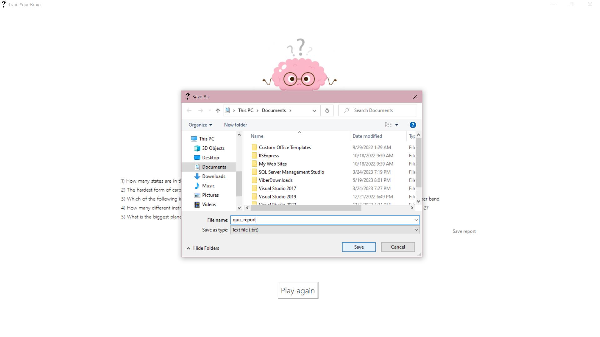
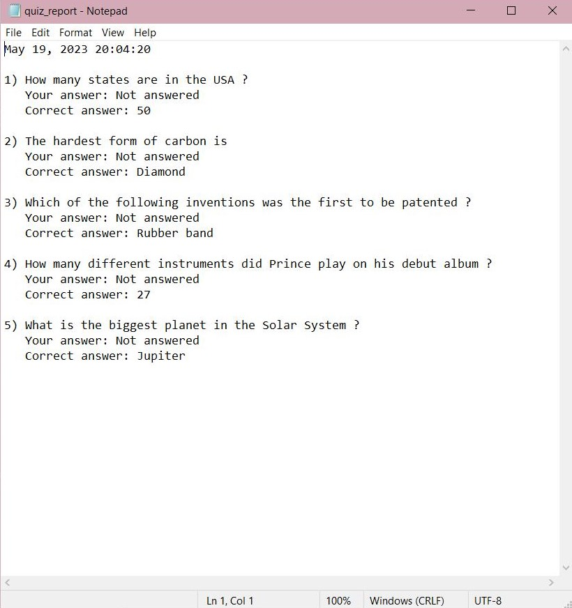

# Python-quiz-app

Simple desktop quiz app created using Tkinter and SQLite3

# Screenshots

Rules 

When you hover over one of the cartoon images, a fun message pops up

Cartoon images at the end may vary based on your result

Saving the report

# Setup

Download the project and run main.py.

# How to play

The quiz has 5 questions, each one from one of 5 different categories. The questions are randomly generated, so you get different questions each time you play.

When you finish the quiz you can review your results and get a detailed report that shows the correct answers, as well as your answers.
You can also save this report as a .txt file on your computer by pressing "Save report" which will let you chose the location to which you want to save the file.
